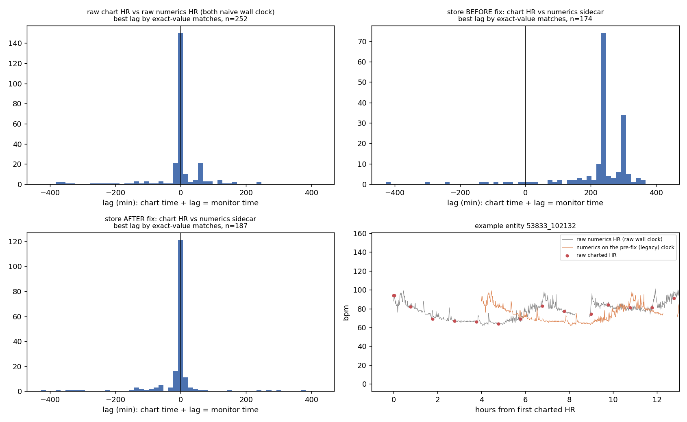

# MIMIC-III waveform ↔ EHR clock audit (raw-data evidence, 2026-09-28)

Question: was the waveform side of the `mimic3` store misaligned with the chart/lab side before the 2026-09 clock fix, and
is it aligned now? This audit answers from the **raw data**, independently of the pipeline's own time conversions
(`workzone/mimic3/explore/audit_alignment_raw.py`; results `/projects/mwang80/staging/mimic3_audit/`).

## Method

* Sample: the 300 entities of the pre-fix snapshot `/projects/mwang80/staging/mimic3_before` (random, `shuf` seeded), which
  holds each entity's pre-fix `time_ms.npy`, `meta.json`, `ehr_events.npy`, `ehr_hf.npy`; the post-fix versions are read from
  the store. Every entity has both versions, so every comparison is before/after on the same patients.
* Raw waveform side: master header `pNNNNNN-YYYY-MM-DD-hh-mm.hea` (base date/time) and the numerics record `…n.hea/.dat`
  (1 Hz HR, cuff `NBP Sys`), read with the `wfdb` package. Base times are taken as the naive surrogate wall clock they are
  written in (MIMIC shifts dates per patient but keeps clock time).
* Raw EHR side: `CHARTEVENTS.csv` (35 GB, uncompressed) filtered to the 300 subjects and ITEMIDs 211/220045 (HR) and
  455/220179 (NBP systolic); `CHARTTIME` taken as the same naive wall clock. 116,579 rows.
* Lag scans: `chart_time + lag = monitor time`, lags −7 h … +7 h in 5-min steps (fine grid ±30 min, 1-min steps); score
  per lag = mean |Δ| and the fraction of charted values that equal the nearest monitor sample (within 90 s) to ≤ 1 bpm
  (≤ 2 mmHg for cuff BP). Charted vitals are nurse snapshots of the monitor, so exact matches peak sharply at the true lag.
* Nothing from `clock_utils`, stage 3/3b/3c or `verify_mimic3_clock.py` is reused.

## Evidence

| # | Comparison (300 entities) | Before the fix | After the fix |
|---|---|---|---|
| E1 | store `time_ms[0]` − raw master-header base time (entities whose recording starts at the record start, n≈174) | **+4.00 h** ×116, **+5.00 h** ×58 (EDT/EST of the surrogate date) | **0.000 h** ×173 (the rest = the later segment offset the recording starts at) |
| — | per-entity shift applied by the fix (`time_ms_after − time_ms_before`) | — | −4 h ×196, −5 h ×104, nothing else |
| E2 | raw chart HR vs raw numerics HR, both on the raw wall clock (n=252) | (ground truth, no store involved) median best lag **0 min**; 77 % within ±15 min, 88 % within ±60 min; fine grid median −2 min (p10 −5, p90 +3); exact-value match 42 % of charted points at lag 0 | |
| E2′ | same, but numerics re-based the way the old code did (local-tz epoch) (n=253) | median best lag **+240 min**, 82 % of entities in the 4–5 h band, 0.4 % within ±15 min; exact match at lag 0 drops to 12 % | |
| E3 | store chart HR events (var 100) vs store numerics sidecar HR (var 150), on the store's own clock | median **+240 min**; 86 % in the 4–5 h band; 2 % within ±15 min; exact match at lag 0: 12 % (n=174) | median **0 min**; 86 % within ±15 min, 93 % within ±60 min; exact match at lag 0: 46 % (n=187) |
| E3′ | store sidecar first HR sample − raw numerics first sample | **+4.03 h** (p10 4.00, p90 5.03; n=155) | **+0.02 h** (p10 0.00, p90 0.07; n=166) |
| E4 | ECG-derived HR from the store's own `II120` segments (beat counting on the waveform) vs raw chart HR | median **+245 min**; 71 % in the 4–5 h band; 2 % within ±15 min (n=42) | median **0 min**; 68 % within ±15 min, 83 % within ±60 min, 0 % in the 4–5 h band (n=41) |
| E4′ | ECG-derived HR (store clock) vs raw numerics HR (raw clock) | — | best lag **0 min** for 45/45 entities (5-min grid) |
| E5 | raw charted cuff systolic vs raw numerics `NBP Sys` (exact match ≤ 2 mmHg) | at ±4 h / ±5 h: 12–14 % of readings match (chance level) | at lag 0: **62.5 %** of readings match (median; p90 100 %; n=226) |
| E6 | store chart-event times ∈ raw `CHARTTIME` set (fraction) | **1.00** (n=217) | **1.00** (n=227) |

*Top-left: raw vs raw peaks at 0. Top-right: the pre-fix store peaks at +240 / +300 min. Bottom-left: the corrected store
peaks at 0. Bottom-right: one entity — charted HR (red) lies on the raw numerics trace (grey) and 4 h off the trace on the
pre-fix clock (orange).*

## Conclusion

1. **The raw data are self-consistent.** Raw WFDB base times and raw `CHARTTIME`s are the same (surrogate) wall clock:
   charted HR matches the monitor HR at lag 0 (E2), charted cuff pressures reproduce the monitor's cuff readings at lag 0
   (E5). No 4–5 h offset exists in MIMIC-III itself.
2. **The pre-fix store was misaligned by exactly +4 h (EDT dates) or +5 h (EST dates).** The waveform clock
   (`time_ms`, and the numerics sidecar derived from it) sat 4–5 h *after* the chart clock (E1, E3, E3′, E4), because
   `datetime.timestamp()` on the naive header time applied the lab node's America/New_York offset while the chart side was
   encoded as plain wall-clock milliseconds. Re-basing the raw numerics the same way reproduces the error (E2′).
3. **The fix is correct and complete for the sampled entities.** After the fix `time_ms[0]` equals the raw header base
   (E1), the numerics sidecar equals the raw numerics clock (E3′), ECG beats counted on the stored waveform agree with both
   the raw numerics and the raw chart at lag 0 (E4, E4′), and chart-event times were never touched (E6). The residual
   spread (≈15–30 % of entities beyond ±15 min in the HR-based scans) is the usual noise of charted HR vs a beat counter
   on noisy ICU ECG and of sparse charting; it is symmetric around 0 and shows no 4–5 h component.

The store therefore now satisfies the API contract "`time_ms` and every `ehr_*` partition share one wall-clock base"
(`datasets/mimic3/API.md`). Rebuilt downstream artefacts (partitions, `ehr_hf`, tasks) inherit this base; models trained
on the pre-fix store learned from labels displaced by 4–5 h and must be retrained (`datasets/CLOCK_FIX_PLAN_MIMIC_MOVER.md` §7).
